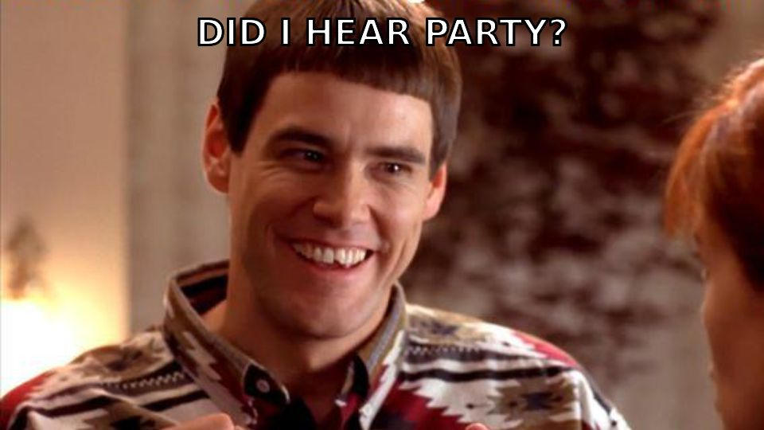

## Patient Intake Party

patient intake is usually a form, but the broader goal is <ins>helping the care team understand the patient's situation</ins>.

this repo has some synthetic, LLM-generated patient examples.

your mission, if you like missions: **Build something that makes patient intake better.**

This could mean:
* collect information differently
* use/summarize/expand information we already have
* figure out what’s missing
* help get the patient to the right next step
* etc.

And maybe the patient has some constraints, like:
* what if they can only use audio
* what if their parent is doing this for them
* what if they have bad internet

> [!TIP]
> **🎉 Or if you're brave, invent a really silly constraint.** Some silly ideas to get you started:
> * the patient has an incredibly short attention span: you can only ask the patient 3 questions
> * the patient can only communicate using... photos? emoji? yes/no answers? 1 word at a time?
> * the patient has an extremely relevant comorbidity that he/she will not notice in a list of checkboxes because he/she doesn't remember what it's called

Anything goes here, e.g. UI, API, agent, workflow, voice, visualization

## The patients

Five made-up patients in [`patients/`](patients). Same shape each: a README, `messages.json`, one CSV, one image. Three are before the visit. Two are in the waiting room right now, and those also have the paper form that was just filled out. **These are just examples. Pick a part of one, or two, or none...whatever is fun to play with.**

Dr. Pepper has 90 seconds before walking into the room. Help the care team figure out what matters.

| Patient | When | Photo | Time series | Proxy |
|---|---|---|---|---|
| [Eczema](patients/eczema) | before visit | rash | itch log | |
| [Strained back](patients/strained-back) | before visit | old x-ray | watch steps and sleep | |
| [GLP-1 / weight loss](patients/glp1) | before visit | mystery pen | weight | |
| [Persistent pain](patients/persistent-pain) | at the clinic | pill bottle | 9 visits, 5 prescribers | wife |
| [Glaucoma](patients/glaucoma) | at the clinic | 2023 eye scan | eye pressure | daughter |

Typical intake form today, the thing to rethink:

* name, date of birth, address, phone
* insurance and member ID
* emergency contact
* reason for visit
* current medications
* allergies
* past conditions (checkbox list)
* past surgeries
* family history
* tobacco, alcohol, drug use
* signature

## Sources

Patients are LLM-generated. Images are real:

* [elbow-photo.png](patients/eczema/elbow-photo.png): [SCIN dataset](https://github.com/google-research-datasets/scin), CC BY 4.0
* [xray-2021.jpg](patients/strained-back/xray-2021.jpg): [Wikimedia Commons](https://commons.wikimedia.org/wiki/File:Lateral_lumbar_x_ray.jpg), CC BY-SA 4.0
* [pen-photo.jpg](patients/glp1/pen-photo.jpg): [Wikimedia Commons](https://commons.wikimedia.org/wiki/File:Ozempic%C2%AE_3ml.jpg), CC BY-SA 4.0
* [pill-bottle.jpg](patients/persistent-pain/pill-bottle.jpg): [Wikimedia Commons](https://commons.wikimedia.org/wiki/File:Pill_Bottle_of_Assorted_Pills.JPG), CC BY-SA 3.0
* [optic-disc-2023.png](patients/glaucoma/optic-disc-2023.png): [Wikimedia Commons](https://commons.wikimedia.org/wiki/File:Optic_disc_topography,_case_1,_R,_glaucoma.png), CC BY-SA 3.0
