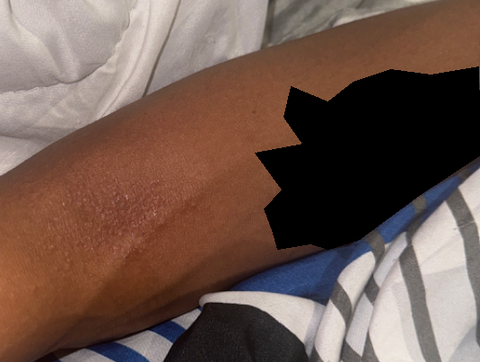
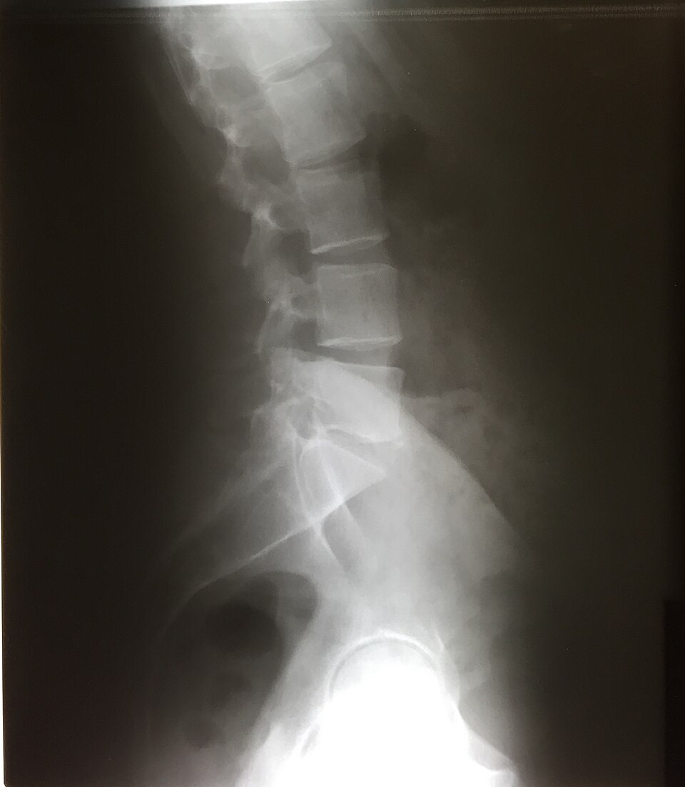
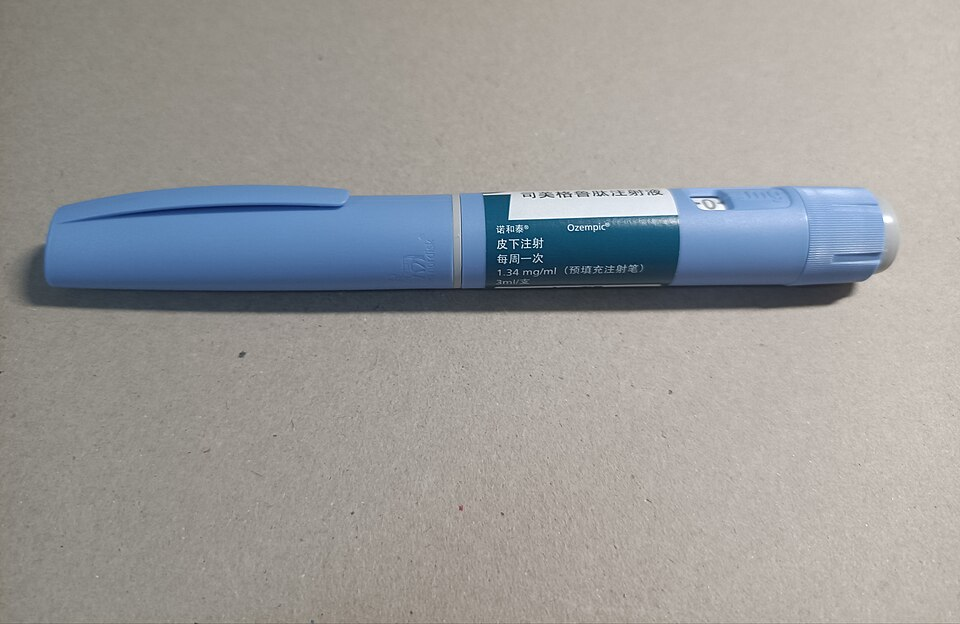
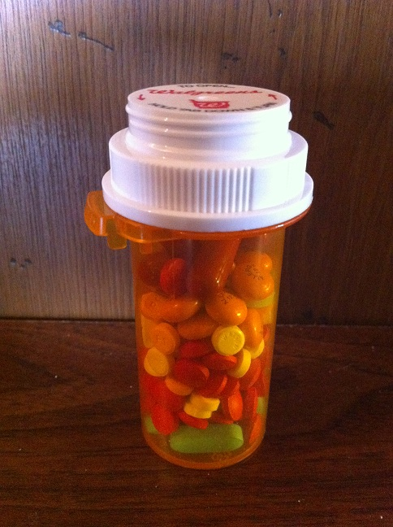
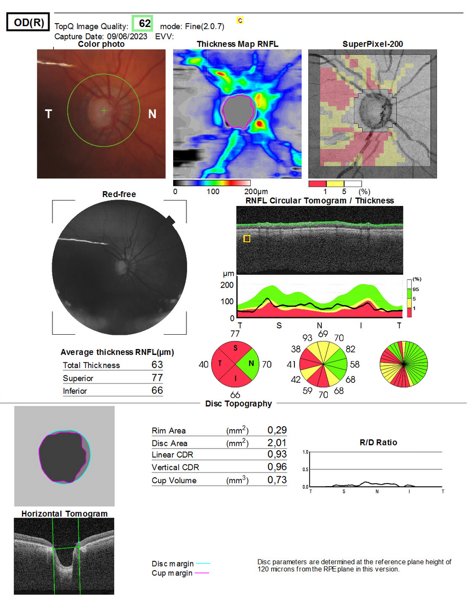

# All five patients

Generated by `make-patients-md.py` from the folders in `patients/`. Edit those, not this file.
Names, dates, messages, and numbers are LLM-generated. Images are real.

---

# Mango Broccoli (eczema)

Eczema: dry, itchy, inflamed skin that flares and settles, often in the elbow and knee creases. Steroid creams and moisturizer are the usual treatment. The care team usually wants to know what set it off, how bad the itch is, and whether the creams are working.

**Before the visit.**

- [what-the-clinic-knows.md](patients/eczema/what-the-clinic-knows.md)
- [whats-actually-going-on.md](patients/eczema/whats-actually-going-on.md)
- Data: [elbow-photo.png](patients/eczema/elbow-photo.png), [itch-log.csv](patients/eczema/itch-log.csv)

# What the clinic knows

**Before the visit.** The chart, plus one text and a photo.

| | |
|---|---|
| Age / sex | 26 / M |
| Here for | Texted 8/18: "rash is back inside my elbows, way worse than last time. Do I need to come in?" |
| Allergies | Penicillin |
| History | Eczema as a kid, mild asthma as a kid, seasonal allergies |
| Photo | Sent 8/19 ([elbow-photo.png](patients/eczema/elbow-photo.png)). Nobody has replied. |
| Contact | Text |

| Medication | Status |
|---|---|
| Cetirizine 10 mg daily | Active |
| Hydrocortisone 1% (OTC) | Patient mentioned using it |
| Triamcinolone 0.1% cream | Prescribed 2025-03, never refilled |

# What's actually going on

What Mango would tell you if you asked.

- Got a puppy in July.
- Switched dish soap about a month ago.
- Started a new job in August. Likes it.
- The drugstore hydrocortisone isn't doing anything.
- Never refilled the prescription cream. It was $60.
- The puppy is named Biscuit.
- Itches worst at night. Scratches in his sleep. Skin is cracking and bleeding now.
- Sent a photo three weeks ago and nobody replied.
- Would rather not come in. Wants a cream that works.
- Logs the itch in an app ([itch-log.csv](patients/eczema/itch-log.csv)).

**itch-log.csv**

| date | itch_0_10 | sleep_hours | note |
|---|---|---|---|
| 2026-08-15 | 4 | 7.0 |  |
| 2026-08-17 | 6 | 6.2 |  |
| 2026-08-19 | 7 | 5.5 | sent photo |
| 2026-08-22 | 7 | 5.8 |  |
| 2026-08-25 | 5 | 6.5 |  |
| 2026-08-28 | 6 | 6.0 |  |
| 2026-08-31 | 8 | 4.9 | scratched in sleep |
| 2026-09-03 | 8 | 5.1 |  |
| 2026-09-05 | 9 | 4.6 | bleeding |

---

# Kiwi Parsnip (strained back)

Strained back: a pulled muscle or ligament in the lower back, usually from lifting. Most get better in a few weeks with movement and over-the-counter painkillers. The care team usually wants to know whether he can move, and whether there's any numbness, weakness, or bladder trouble, which would mean something more serious.

**Walk-in, blank chart.**

- [what-the-clinic-knows.md](patients/strained-back/what-the-clinic-knows.md)
- [whats-actually-going-on.md](patients/strained-back/whats-actually-going-on.md)
- Data: [activity.csv](patients/strained-back/activity.csv), [xray-2021.jpg](patients/strained-back/xray-2021.jpg)

# What the clinic knows

**Walk-in.** Kiwi booked online last night. This is everything.

| | |
|---|---|
| Age / sex | 44 / M |
| Here for | "back pain, want a PT referral" |
| History | Nothing on file |
| Medications | Nothing on file |
| Allergies | Nothing on file |
| Contact | Phone, evenings |

# What's actually going on

What Kiwi would tell you if you asked.

- Hurt his back Saturday 8/29 moving a couch. Lower right side.
- Same thing in 2021. PT fixed it. Has the urgent care x-ray on his phone ([xray-2021.jpg](patients/strained-back/xray-2021.jpg)).
- The couch was his sister's. She still owes him lunch.
- Takes lisinopril for blood pressure, from a different doctor.
- Ibuprofen a few times a day since it happened.
- Right foot has felt a little tingly since Tuesday. Hasn't thought it worth mentioning.
- Worse in the morning. Hasn't run all week.
- Wears a watch and would share the data ([activity.csv](patients/strained-back/activity.csv)).
- Wants the PT referral without a visit if possible.

**activity.csv**

| date | steps | sleep_hours | note |
|---|---|---|---|
| 2026-08-22 | 11240 | 7.1 |  |
| 2026-08-23 | 9870 | 6.8 |  |
| 2026-08-24 | 12410 | 7.4 | run |
| 2026-08-25 | 10120 | 7.0 |  |
| 2026-08-26 | 11980 | 6.9 | run |
| 2026-08-27 | 9450 | 7.3 |  |
| 2026-08-28 | 12870 | 7.2 | run |
| 2026-08-29 | 6310 | 5.2 | injury (moved couch) |
| 2026-08-30 | 1840 | 4.9 |  |
| 2026-08-31 | 2210 | 5.1 |  |
| 2026-09-01 | 3120 | 5.6 |  |
| 2026-09-02 | 3890 | 6.0 |  |
| 2026-09-03 | 4560 | 6.2 |  |
| 2026-09-04 | 4210 | 5.8 |  |
| 2026-09-05 | 5030 | 6.4 |  |
| 2026-09-06 | 4780 | 6.1 |  |

---

# Papaya Radish (GLP-1 / weight loss)

Semaglutide: a weekly injection for weight loss and diabetes. The dose goes up in steps, and nausea is the common side effect. The care team usually wants to know what dose she's really on, how she's tolerating it, and how the weight is trending.

**Before the visit.**

- [what-the-clinic-knows.md](patients/glp1/what-the-clinic-knows.md)
- [whats-actually-going-on.md](patients/glp1/whats-actually-going-on.md)
- Data: [pen-photo.jpg](patients/glp1/pen-photo.jpg), [weight.csv](patients/glp1/weight.csv)

# What the clinic knows

**Before the visit.** The chart, plus scale readings.

| | |
|---|---|
| Age / sex | 38 / F |
| Here for | 6-month follow-up on semaglutide |
| Allergies | None |
| History | Prediabetes 2022, PCOS 2024, started semaglutide 2026-02 |
| Notes | 6/16: portal message forwarded to Dr. Pepper. No follow-up. |
| Weight | Connected scale, see [weight.csv](patients/glp1/weight.csv) |
| Contact | Portal |

| Medication | Status |
|---|---|
| Semaglutide weekly, 1.0 mg | Active, increased 2026-06 |
| Metformin 500 mg twice daily | Active |
| Prenatal vitamin | Active |

# What's actually going on

What Papaya would tell you if you asked.

- Went back to 0.5 mg in June after vomiting on 1 mg. Sent one portal message about it, which got forwarded and never answered.
- Nausea is fine on 0.5.
- Training for a 5k in October.
- Missed two weeks in August. Pharmacy backorder.
- Her cousin mailed a pen from overseas ([pen-photo.jpg](patients/glp1/pen-photo.jpg)). She's using it. Not sure it's the same dose.
- Switched to oat milk.
- Weight is up about 3 lb since July ([weight.csv](patients/glp1/weight.csv)).
- Planning to try for a baby in the spring. Doesn't know if she should stop.
- Still on metformin and a prenatal vitamin.

**weight.csv**

| date | weight_lb | source |
|---|---|---|
| 2026-02-03 | 214.0 | connected scale |
| 2026-02-17 | 212.6 | connected scale |
| 2026-03-03 | 210.1 | connected scale |
| 2026-03-17 | 207.8 | connected scale |
| 2026-04-07 | 204.5 | connected scale |
| 2026-04-21 | 202.2 | connected scale |
| 2026-05-05 | 199.6 | connected scale |
| 2026-05-19 | 197.9 | connected scale |
| 2026-06-02 | 196.3 | connected scale |
| 2026-06-16 | 193.8 | connected scale |
| 2026-07-07 | 192.5 | connected scale |
| 2026-07-21 | 191.9 | connected scale |
| 2026-08-04 | 192.4 | connected scale |
| 2026-08-18 | 194.1 | connected scale |
| 2026-09-01 | 195.3 | connected scale |

---

# Fig Turnip (pain that hasn't gone away)

Persistent pain: pain that has lasted months with no single clear cause, usually with several doctors and several medications along the way. The care team usually wants to know what he's actually taking, what's been tried, and what's changed.

**At the clinic, in the waiting room.**

- [what-the-clinic-knows.md](patients/persistent-pain/what-the-clinic-knows.md)
- [whats-actually-going-on.md](patients/persistent-pain/whats-actually-going-on.md)
- Data: [intake-form.json](patients/persistent-pain/intake-form.json), [pill-bottle.jpg](patients/persistent-pain/pill-bottle.jpg), [visits.csv](patients/persistent-pain/visits.csv)

# What the clinic knows

**At the clinic.** Fig is in the waiting room. The chart, plus the paper form his wife just filled out.

| | |
|---|---|
| Age / sex | 61 / M |
| Here for | "Same pain, nothing is working" |
| Allergies | Codeine (nausea) |
| History | Knee replacement 2019, type 2 diabetes, depression |
| Visits | 9 pain visits in 18 months, see [visits.csv](patients/persistent-pain/visits.csv) |
| Insurance | Employer plan, through his wife |
| Contact | Phone. His wife Olive uses the portal for him. |

| Medication | Prescriber | Status |
|---|---|---|
| Metformin 1000 mg twice daily | Dr. Pepper (primary care) | Active |
| Sertraline 50 mg daily | Dr. Pepper (primary care) | Active |
| Gabapentin 300 mg three times daily | Dr. Pepper (neurology) | Active |
| Meloxicam 15 mg daily | Dr. Pepper (orthopedics) | Active |
| Cyclobenzaprine 10 mg at night | Dr. Pepper (urgent care) | Active, 2025 |

## Paper form

Filled out today at the front desk. Same as [intake-form.json](patients/persistent-pain/intake-form.json).

| | |
|---|---|
| filled out by | Olive Turnip (wife) |
| date | 2026-08-27 |
| name | Fig Turnip |
| date of birth | 1965-03-14 |
| address | 12 Garden Row |
| phone | 555-0143 |
| insurance | BlueCross, through my work |
| member id |  |
| emergency contact | Olive Turnip, wife, 555-0143 |
| reason for visit | pain |
| current medications | metformin, the nerve pill, meloxicam, tylenol |
| allergies | none |
| past conditions | diabetes |
| past surgeries | knee |
| family history | father heart |
| tobacco | quit |
| alcohol | some |
| drugs | no |
| signature | O. Turnip (wife) |

# What's actually going on

What Fig would tell you if you asked.

- Stopped sertraline months ago. Nobody at the clinic knows.
- Keeps all his pills in one bottle ([pill-bottle.jpg](patients/persistent-pain/pill-bottle.jpg)). Doesn't know which is which.
- Wants to talk about his neighbor's fence.
- Skips gabapentin some days because it makes him foggy.
- Meloxicam every day. Tylenol "whenever."
- Finished the cyclobenzaprine in 2025.
- Not sleeping.
- Has stopped answering questions himself. His wife does the talking.
- 9 visits, 5 doctors in 18 months ([visits.csv](patients/persistent-pain/visits.csv)).

**visits.csv**

| date | setting | chief_complaint | pain_score_0_10 | outcome |
|---|---|---|---|---|
| 2025-03-11 | primary care | left knee pain | 6 | x-ray ordered |
| 2025-05-02 | orthopedics | left knee pain | 7 | meloxicam started |
| 2025-08-19 | urgent care | low back pain | 8 | cyclobenzaprine |
| 2025-10-07 | primary care | back and hip pain, poor sleep | 7 | referred to physical therapy |
| 2025-11-14 | physical therapy | low back pain | 6 | attended 2 of 8 sessions |
| 2026-01-22 | primary care | pain all over, tired | 8 | labs ordered |
| 2026-03-05 | neurology | burning in both feet | 7 | gabapentin started |
| 2026-06-18 | emergency dept | chest wall pain | 9 | EKG normal, discharged |
| 2026-08-27 | primary care | same pain, nothing is working | 8 | this visit |

---

# Plum Kohlrabi (glaucoma)

Glaucoma: pressure inside the eye slowly damages the nerve. Daily eye drops keep the pressure down, and vision already lost does not come back. The care team usually wants to know whether he's using the drops, what the pressure has been doing, and whether he's safe getting around.

**At the clinic, in the waiting room. New patient.**

- [what-the-clinic-knows.md](patients/glaucoma/what-the-clinic-knows.md)
- [whats-actually-going-on.md](patients/glaucoma/whats-actually-going-on.md)
- Data: [eye-pressure.csv](patients/glaucoma/eye-pressure.csv), [intake-form.json](patients/glaucoma/intake-form.json), [optic-disc-2023.png](patients/glaucoma/optic-disc-2023.png)

# What the clinic knows

**At the clinic.** Plum is in the waiting room, new patient. The paper form his daughter just filled out, plus the old eye clinic printouts she brought.

| | |
|---|---|
| Age / sex | 83 / M |
| Here for | New patient, transferring from an out-of-state eye clinic |
| Allergies | Sulfa (from the form) |
| Old records | Glaucoma since 2019, right worse. Laser 2021. Last exam 2023-09: [optic-disc-2023.png](patients/glaucoma/optic-disc-2023.png), [eye-pressure.csv](patients/glaucoma/eye-pressure.csv) |
| Contact | Daughter Cherry, by phone. He doesn't use a phone or portal. |

| Medication (per 2023 records) | Status |
|---|---|
| Latanoprost drops, both eyes at bedtime | Active |
| Timolol drops, both eyes twice daily | Active |

## Paper form

Filled out today at the front desk. Same as [intake-form.json](patients/glaucoma/intake-form.json).

| | |
|---|---|
| filled out by | Cherry Kohlrabi (daughter) |
| date | 2026-09-08 |
| name | Plum Kohlrabi |
| date of birth | 1943-06-02 |
| address | 88 Orchard Lane (my house) |
| phone | 555-0199 (mine) |
| insurance | Medicare |
| member id |  |
| emergency contact | Cherry Kohlrabi, daughter, 555-0199 |
| reason for visit | new patient, glaucoma |
| current medications | eye drops (2 kinds?), inhaler, aspirin |
| allergies | sulfa |
| past conditions | (none checked) |
| past surgeries | laser eye 2021? |
| family history | don't know |
| tobacco | smoked 40 years, quit 2015 |
| alcohol | no |
| drugs | no |
| signature | Cherry Kohlrabi for Plum Kohlrabi. He can't read the form, I filled it out. |

# What's actually going on

What Plum would tell you if you asked.

- Uses latanoprost most nights. Forgets sometimes.
- Stopped timolol on his own a year ago because it made him wheeze. Never told the eye clinic.
- Watches the same baseball game twice if his daughter records it.
- The third bottle on the sink is an old brimonidine from 2021.
- Has COPD and uses an inhaler. His daughter didn't check it on the form.
- Wants to know if the clinic validates parking.
- Bumped into doorframes twice last month. Fell once in 2025.
- Last eye exam was September 2023 ([optic-disc-2023.png](patients/glaucoma/optic-disc-2023.png), [eye-pressure.csv](patients/glaucoma/eye-pressure.csv)).
- Says his eyes are fine.
- Can't read the form. His daughter fills everything out.

**eye-pressure.csv**

| date | right_eye_mmHg | left_eye_mmHg | note |
|---|---|---|---|
| 2019-04-10 | 29 | 24 | diagnosis |
| 2019-07-15 | 21 | 18 |  |
| 2020-06-02 | 20 | 17 |  |
| 2021-03-09 | 26 | 19 |  |
| 2021-05-20 | 18 | 17 | after laser |
| 2022-08-11 | 19 | 17 |  |
| 2023-09-06 | 22 | 18 | last visit |

